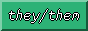

# hello! i'm coco ✌️
### about me
* they/any pronouns
* queer & proud 🏳️‍🌈
* currently a comp sci student
* love doing random projects

   

### languages
* most comfortable with HTML and CSS
* pretty comfortable with python
* currently learning java

### software i use
* **web browser:** firefox dev
* **text/code:** visual studio code, vim
* **java IDE:** eclipse
* **image editing:** paint.net
* **vector:** inkscape
